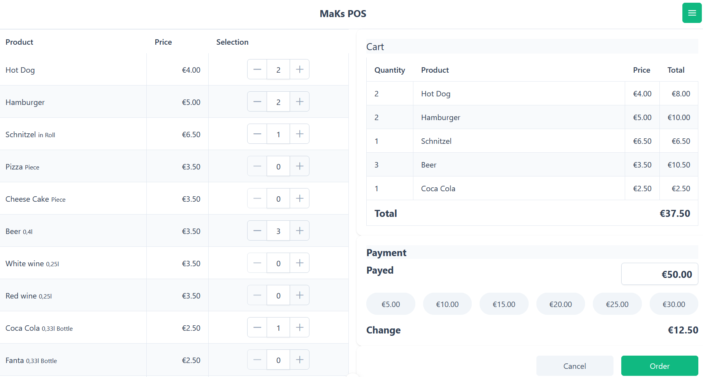
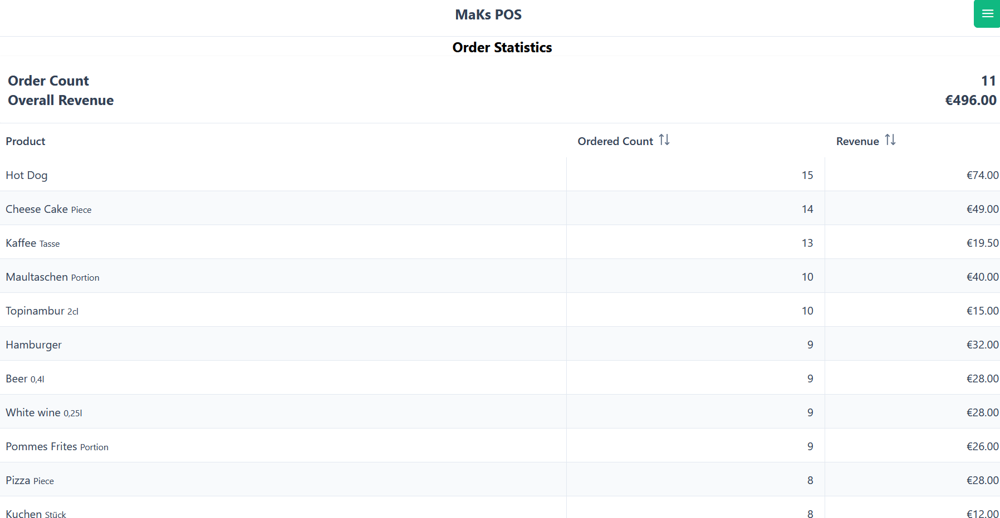

# MaKs POS

Simple Point of Sales system for clubs, street festivals and events that do not require a professional POS system.
Inventory management, electronic payment or tax functions are currently not implemented.

<figure style="text-align: center">
  
  <figcaption>Order Entry</figcaption>
</figure>

<figure style="text-align: center">
  
  <figcaption>Order Statistics</figcaption>
</figure>

## Technology stack
- Backend
  - [Kotlin](https://kotlinlang.org/)
  - [Quarkus](https://quarkus.io/)
- Frontend
  - [TypeScript](https://www.typescriptlang.org/)
  - [Vue](https://vuejs.org/)
  - [PrimeVue](https://primevue.org/)
  - [TailwindCSS](https://tailwindcss.com/)

# Setup from source

## Prerequisites

- [Java 21](https://openjdk.org/)

## Build
```shell script
./mvnw package
```
## Run application

```shell script
java -jar target/quarkus-app/quarkus-run.jar
```
Open [MaKs POS UI](http://localhost:8080) ([http://localhost:8080](http://localhost:8080))

## Configuration

### Products (`<data>/products.json`)

JSON configurationfile with all products.

File format:
```json
[
  {
    "id": "1001",
    "name": "Coke", 
    "description": "0.33l, Bottle", 
    "price": 3.00 
  },
... 
]
```

### UI configuration (`<data>/config.properties`)

Localizable configuration of the Webapp include all labels/texts displayed in the UI.

### Quarkus application properties (`src/main/resources/application.properties`)
The Quarkus [application.properties](./src/main/resources/application.properties) contains the configuration of the Quarkus backend.

See: [Quarkus configuration guide](https://quarkus.io/guides/config)

## Order data

The orders are stored in the [JSON Lines](https://jsonlines.org) file `<data>/orders.jsonl`.

# Development

## Running the application in dev mode for live coding

```shell script
./mvnw compile quarkus:dev
```

Open on localhost
- [MaKs POS UI](http://localhost:8080)
- [Quarkus Dev UI](http://localhost:8080/q/dev/)
- [REST API (SwaggerUI)](http://localhost:8080/q/swagger-ui/)


## Build release

```shell script
mvn external.atlassian.jgitflow:jgitflow-maven-plugin:1.0-m5.1:release-start -DautoVersionSubmodules=true -DupdateDependencies=true -DreleaseVersion=1.0.0 -DdevelopmentVersion=1.1.0-SNAPSHOT
# locale branch release/[releaseVersion] created
# make changes for release, e.g. set versions
# local test in branch release/[releaseVersion]
mvn external.atlassian.jgitflow:jgitflow-maven-plugin:1.0-m5.1:release-finish -DautoVersionSubmodules=true -DnoDeploy=true -DupdateDependencies=true -DreleaseVersion=1.0.0 -DdevelopmentVersion=1.1.0-SNAPSHOT
git push
git checkout main
git push
git push --tags
```

## Creating a native executable

You can create a native executable using:

```shell script
./mvnw package -Dnative
```

Or, if you don't have GraalVM installed, you can run the native executable build in a container using:

```shell script
./mvnw package -Dnative -Dquarkus.native.container-build=true
```

You can then execute your native executable with: `./target/makspos-*-runner`

## Quarkus guides

- [Kotlin](https://quarkus.io/guides/kotlin)
- [REST](https://quarkus.io/guides/rest)
- [OpenAPI/SwaggerUI](https://quarkus.io/guides/openapi-swaggerui)
- [Quinoa/Frontend](https://docs.quarkiverse.io/quarkus-quinoa/dev/index.html)

## Frontend development

The sources of the frontend are located in `src/main/webui`. The fronted is automatically build with [Quinoa](https://docs.quarkiverse.io/quarkus-quinoa/dev/index.html)

### Customize configuration

See [Vite Configuration Reference](https://vitejs.dev/config/).

### Project Setup

```sh
npm install
```

### Compile and Hot-Reload for Development

```sh
npm run dev
```

### Type-Check, Compile and Minify for Production

```sh
npm run build
```

### Lint with [ESLint](https://eslint.org/)

```sh
npm run lint
```

### Format sources with [prettier](https://prettier.io/)

```sh
npm run format
```